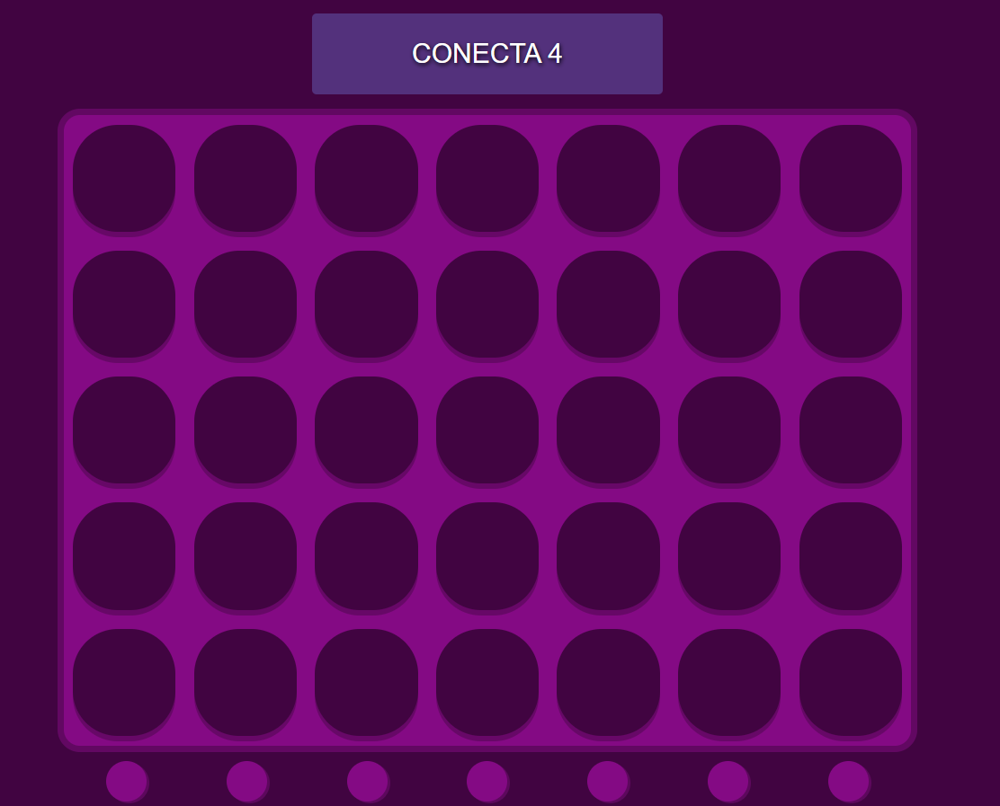
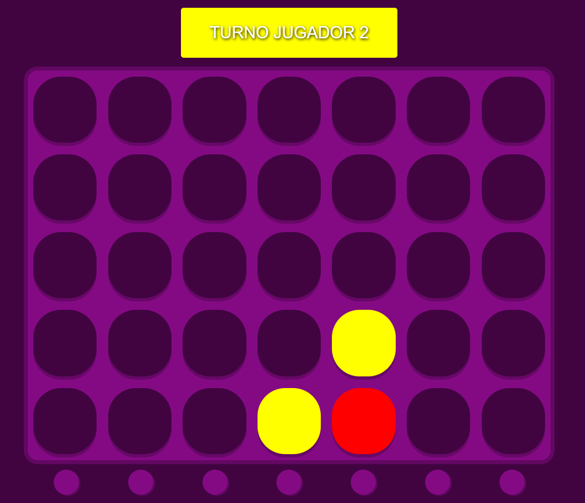
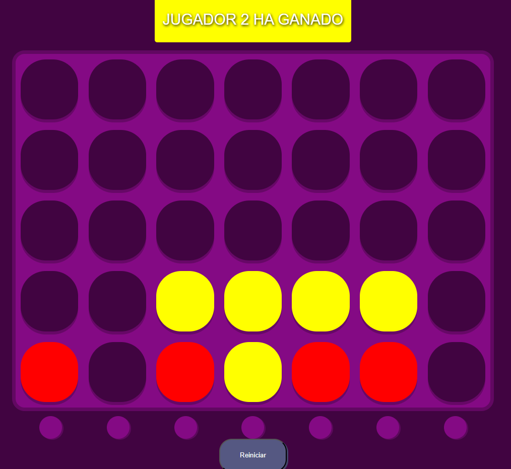

# 🎮 Proyecto: Conecta 4  

¡Bienvenido/a! Este repositorio contiene una implementación del clásico juego de **Conecta 4**, desarrollado con **HTML**, **CSS** y **JavaScript**. Es un proyecto realizado como práctica en 1º DAW para mejorar habilidades en desarrollo web.  

---

## 📝 NOTA!!

**Pendiente de mejora de código**. Código realizado a mediados del 2024

---

## ✨ Descripción del Proyecto  

**Conecta 4** es un juego para dos jugadores donde el objetivo es alinear cuatro fichas consecutivas en el tablero, ya sea en línea horizontal, vertical o diagonal. Este proyecto incluye:  

- **Interacción por turnos**: Jugadores alternan para colocar sus fichas.  
- **Detección automática de ganadores**: Comprueba automáticamente si alguien ha ganado (horizontal, vertical, o diagonal).  
- **Diseño visual atractivo**: Uso de CSS para un tablero interactivo y responsive.  
- **Fácil de usar**: Reinicio rápido del juego al recargar la página.  

---

## 🛠️ Tecnologías Utilizadas  

- **HTML5**: Estructura principal del proyecto.  
- **CSS3**: Estilos para el diseño del tablero y botones.  
- **JavaScript**: Lógica del juego, detección de jugadas y eventos interactivos.  

---

## 🚀 Cómo Jugar  

1. Clona este repositorio:  
   ```bash
   git clone https://github.com/DannaPatricia/conecta-4.git
2. Navega al directorio del proyecto: 
   ```bash
   cd conecta-4
3. Abre el archivo index.html en tu navegador:
   ```bash
    open index.html
4. ¡Disfruta del juego! Los jugadores se turnan para colocar fichas en el tablero haciendo clic en los botones.


---

## 🧩 Estructura del Proyecto

- **index.html**: Archivo principal que contiene la estructura HTML del juego.. 
- **Conecta.css**: Archivo de estilos que da diseño al tablero y botones.  
- **Conecta.js**:  Archivo JavaScript que implementa la lógica del juego.  

---

## 🎨 Capturas de Pantalla

1. **Inicio**:
<div align = "center">
   
</div>

 2. **Juego**:
<div align = "center">
   
</div>

 3. **Victoria de jugador**:
<div align = "center">
   
</div>

---


## 🔧 Próximas Mejoras

- Añadir un sistema de reinicio automático sin recargar la página.
- Implementar un modo de juego contra la máquina (IA).
- Mejorar la detección de empates.
- Crear una interfaz más personalizada y atractiva.

---

## 🤝 Contribuciones

1. Haz un fork del repositorio.
2. Crea una rama para tu funcionalidad:
   ```bash
    git checkout -b mejora-nueva-funcion
3. Realiza los cambios y haz commmit:
   ```bash
   git commit -m "Añadida nueva función X"
4. Haz push a tu rama:
   ```bash
    git push origin mejora-nueva-funcion
5. Crea un pull request desde GitHub.

---

## 📜 Licencia
Este proyecto está bajo la Licencia MIT. Puedes consultar más detalles en el archivo LICENSE.

---

¡Gracias por tu interés en este proyecto! 🚀


   

